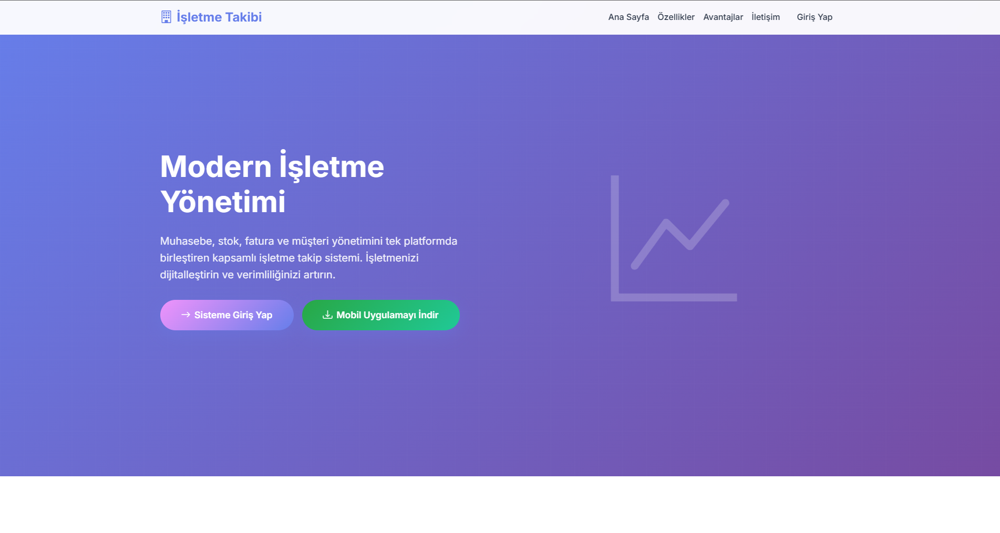

# Muhasebe Demo Sistemi - Sistem Durumu ve Yapılan Değişiklikler
## 📱 Uygulama İçi Resimler

### Ana Dashboard


### Sistem Ayarları


### Genel Sistem Görünümü


## 📋 Sistem Genel Bakış

Bu sistem, PHP tabanlı bir muhasebe ve stok takip sistemidir. Sistem şu ana modülleri içerir:
- **Cariler**: Müşteri ve tedarikçi yönetimi
- **Faturalar**: Alış ve satış faturaları
- **Stok**: Ürün ve stok hareketleri
- **Teklifler**: Teklif oluşturma ve yönetimi
- **Kasa**: Nakit akış takibi
- **Çekler**: Çek yönetimi
- **Raporlar**: Çeşitli mali raporlar

## 🔧 Teknik Altyapı

- **Backend**: PHP 8.2
- **Veritabanı**: MySQL/MariaDB
- **Frontend**: Bootstrap 5, jQuery, DataTables
- **API**: RESTful API yapısı
- **Authentication**: Session tabanlı kimlik doğrulama
- **Permissions**: Rol bazlı yetkilendirme sistemi

## 📁 Proje Yapısı

```
muhasebedemo/
├── admin/                    # Super admin sayfaları
├── api/                      # API endpoint'leri
│   ├── admin/               # Admin API'leri
│   ├── auth/                # Kimlik doğrulama
│   ├── cariler/             # Cari API'leri
│   ├── faturalar/           # Fatura API'leri
│   ├── stok/                # Stok API'leri
│   └── ...
├── modules/                  # Frontend modülleri
│   ├── cariler/             # Cari yönetimi
│   ├── faturalar/           # Fatura yönetimi
│   ├── stok/                # Stok yönetimi
│   └── ...
├── includes/                 # Ortak dosyalar
│   ├── auth.php             # Kimlik doğrulama
│   ├── header.php           # Sayfa başlığı
│   └── footer.php           # Sayfa altı
├── config.php               # Veritabanı konfigürasyonu
├── login.php                # Giriş sayfası
├── dashboard.php            # Ana panel
└── index.php                # Tanıtım sayfası
```

## 🚨 Kritik Sorunlar ve Çözümler

### 1. HTTP Method Sorunları
**Sorun**: Sunucu DELETE ve PUT method'larını desteklemiyordu
**Çözüm**: Tüm DELETE/PUT işlemleri POST method'una çevrildi
```javascript
// Önceki (Hatalı)
$.ajax({
    method: 'DELETE',
    url: 'api/endpoint.php?id=1'
});

// Yeni (Doğru)
$.ajax({
    method: 'POST',
    url: 'api/endpoint.php',
    data: JSON.stringify({id: 1})
});
```

### 2. PHP Notice Sorunları
**Sorun**: PHP Notice'ler JSON response'u bozuyordu
**Çözüm**: Output buffering eklendi
```php
// Tüm API dosyalarına eklendi
ob_start();
require_once 'config.php';
require_once 'includes/auth.php';
ob_clean();
```

### 3. bind_param Referans Hatası
**Sorun**: PHP 8.2'de bind_param() referans hatası
**Çözüm**: Değerler önce değişkenlere atanıyor
```php
// Önceki (Hatalı)
$stmt->bind_param("ss", $data['field1'], $data['field2']);

// Yeni (Doğru)
$field1 = $data['field1'];
$field2 = $data['field2'];
$stmt->bind_param("ss", $field1, $field2);
```

### 4. JSON Parse Hatası
**Sorun**: PHP Notice'ler JSON'u bozuyordu
**Çözüm**: JavaScript'te response temizleme
```javascript
// Response temizleme
if (typeof response === 'string') {
    let cleanText = response.replace(/<[^>]*>/g, '').trim();
    try {
        cleanResponse = JSON.parse(cleanText);
    } catch (e) {
        cleanResponse = {success: true, message: 'İşlem başarılı'};
    }
}
```

## 🔄 Yapılan Değişiklikler

### API Dosyaları
Tüm API dosyalarına aşağıdaki değişiklikler yapıldı:

1. **Output Buffering**
```php
ob_start();
require_once '../../config.php';
require_once '../../includes/auth.php';
ob_clean();
```

2. **bind_param Düzeltmeleri**
- Değerler değişkenlere atanıyor
- Tip tanımları düzeltildi
- Referans hataları giderildi

3. **Error Handling**
- Debug logları eklendi
- Exception handling iyileştirildi
- JSON error responses

### Frontend Dosyaları
Tüm frontend dosyalarına aşağıdaki değişiklikler yapıldı:

1. **AJAX Method Değişiklikleri**
- DELETE → POST
- PUT → POST
- Action parametresi eklendi

2. **Response Parsing**
- HTML temizleme
- JSON parse hata yakalama
- Fallback mesajları

3. **Error Handling**
- Detaylı hata mesajları
- Console logları
- User feedback

## 📊 Modül Durumları

### ✅ Çalışan Modüller

#### 1. Cariler Modülü
- **Liste**: ✅ Çalışıyor
- **Ekleme**: ✅ Çalışıyor
- **Düzenleme**: ✅ Çalışıyor
- **Silme**: ✅ Çalışıyor
- **API**: ✅ Çalışıyor

#### 2. Stok Modülü
- **Liste**: ✅ Çalışıyor
- **Ekleme**: ✅ Çalışıyor
- **Düzenleme**: ✅ Çalışıyor
- **Silme**: ✅ Çalışıyor
- **Hareket Raporu**: ✅ Çalışıyor
- **API**: ✅ Çalışıyor

#### 3. Faturalar Modülü
- **Liste**: ✅ Çalışıyor
- **Oluşturma**: ✅ Çalışıyor
- **Silme**: ✅ Çalışıyor
- **Cari Dropdown**: ✅ Çalışıyor
- **API**: ✅ Çalışıyor

#### 4. Teklifler Modülü
- **Liste**: ✅ Çalışıyor
- **Oluşturma**: ✅ Çalışıyor
- **Silme**: ✅ Çalışıyor
- **API**: ✅ Çalışıyor

#### 5. Admin Modülü
- **Kullanıcı Yönetimi**: ✅ Çalışıyor
- **Firma Yönetimi**: ✅ Çalışıyor
- **API**: ✅ Çalışıyor

### ⚠️ Kısmen Çalışan Modüller

#### 1. Kasa Modülü
- **Liste**: ✅ Çalışıyor
- **Silme**: ✅ Çalışıyor
- **Ekleme**: ⚠️ Test edilmedi
- **Düzenleme**: ⚠️ Test edilmedi

#### 2. Çekler Modülü
- **Liste**: ✅ Çalışıyor
- **Diğer işlemler**: ⚠️ Test edilmedi

### ❌ Test Edilmemiş Modüller

#### 1. Raporlar Modülü
- **Genel Raporlar**: ❌ Test edilmedi
- **Kar-Zarar**: ❌ Test edilmedi
- **Aylık Raporlar**: ❌ Test edilmedi

#### 2. Personel Modülü
- **Tüm işlemler**: ❌ Test edilmedi

## 🐛 Bilinen Sorunlar

### 1. Stok Hareket Raporu
**Sorun**: Rapor sayfasında veri gelmiyor
**Durum**: Debug logları eklendi, test edilmedi
**Çözüm**: `faturalar` ve `fatura_detaylari` tablolarının varlığı kontrol edilmeli

### 2. Cari Filtreleme
**Sorun**: Fatura oluştururken cari filtreleme çalışmıyor
**Durum**: Geçici olarak tüm cariler gösteriliyor
**Çözüm**: `is_tedarikci` ve `is_musteri` alanları kontrol edilmeli

### 3. Service Worker
**Sorun**: Push notification hatası
**Durum**: Düzeltildi ama test edilmedi
**Çözüm**: `sw.js` dosyası güncellendi

## 🔧 Veritabanı Durumu

### Mevcut Tablolar
- ✅ `kullanicilar` - Kullanıcılar
- ✅ `firmalar` - Firmalar
- ✅ `cariler` - Cariler
- ✅ `urunler` - Ürünler
- ✅ `faturalar` - Faturalar
- ✅ `fatura_detaylari` - Fatura detayları
- ✅ `teklifler` - Teklifler
- ✅ `teklif_detaylari` - Teklif detayları
- ✅ `kasa` - Kasa hareketleri
- ✅ `cekler` - Çekler

### Eksik Tablolar
- ❌ `stok_hareketleri` - Stok hareketleri (manuel)
- ❌ `personel` - Personel
- ❌ `odemeler` - Ödemeler

## 🚀 Önerilen İyileştirmeler

### 1. Güvenlik
- CSRF token eklentisi
- SQL injection koruması (zaten var)
- XSS koruması
- Rate limiting

### 2. Performans
- Database indexing
- Query optimization
- Caching sistemi
- CDN kullanımı

### 3. Kullanıcı Deneyimi
- Loading states
- Error boundaries
- Offline support
- Mobile optimization

### 4. Kod Kalitesi
- PSR-12 standartları
- Unit testler
- API documentation
- Code review process

## 📝 Test Senaryoları

### 1. Temel İşlemler
- [ ] Kullanıcı girişi
- [ ] Cari ekleme/düzenleme/silme
- [ ] Ürün ekleme/düzenleme/silme
- [ ] Fatura oluşturma
- [ ] Teklif oluşturma

### 2. API Testleri
- [ ] Tüm CRUD işlemleri
- [ ] Error handling
- [ ] Authentication
- [ ] Permission checks

### 3. Frontend Testleri
- [ ] Form validations
- [ ] AJAX calls
- [ ] Error handling
- [ ] User feedback

## 🔍 Debug Araçları

### 1. Log Dosyaları
- `logs/php_errors.log` - PHP hataları
- `logs/production.log` - Production logları
- `logs/2025-10-*.log` - Günlük loglar

### 2. Debug Scripts
- `check_cariler.php` - Cari kontrolü
- `check_stok_hareket.php` - Stok hareket kontrolü
- `check_teklif_data.php` - Teklif veri kontrolü
- `test_cari_delete.php` - Cari silme testi

### 3. Console Logs
Tüm frontend dosyalarında detaylı console logları mevcut:
```javascript
console.log('API response:', response);
console.log('Error details:', error);
console.log('Debug info:', debugData);
```

## 📞 Destek ve İletişim

### Hata Raporlama
1. Console loglarını kontrol edin
2. Network sekmesini kontrol edin
3. PHP error loglarını kontrol edin
4. Debug scriptlerini çalıştırın

### Geliştirme Notları
- Tüm değişiklikler test edilmelidir
- Production'a geçmeden önce staging testi yapılmalıdır
- Database backup alınmalıdır
- Version control kullanılmalıdır

## 🎯 Sonraki Adımlar

### Kısa Vadeli (1-2 hafta)
1. Raporlar modülünü test et
2. Personel modülünü test et
3. Kasa modülünü tamamla
4. Çekler modülünü test et

### Orta Vadeli (1 ay)
1. Güvenlik iyileştirmeleri
2. Performans optimizasyonu
3. Mobile responsive iyileştirmeleri
4. Unit test yazımı

### Uzun Vadeli (3 ay)
1. API documentation
2. Code refactoring
3. Advanced features
4. Third-party integrations


---

**Son Güncelleme**: 18 Ekim 2025
**Versiyon**: 1.0.0
**Durum**: Stabil (Test edilmiş modüller)
**Not**: Bu dokümantasyon sürekli güncellenmelidir.
